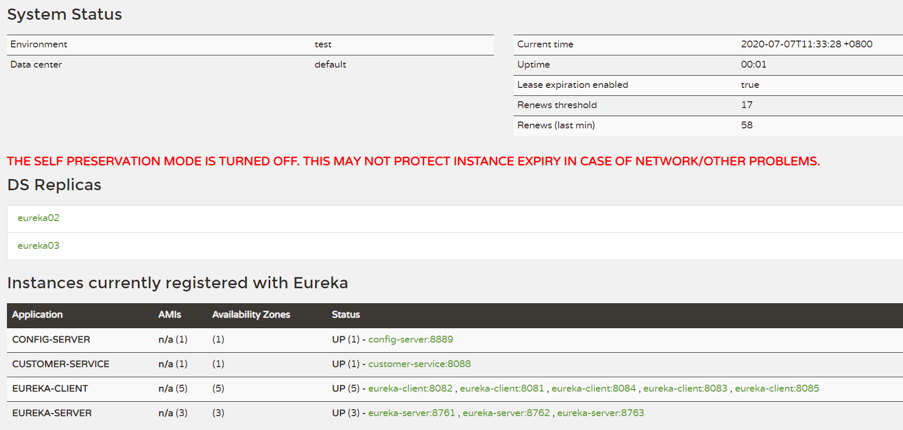
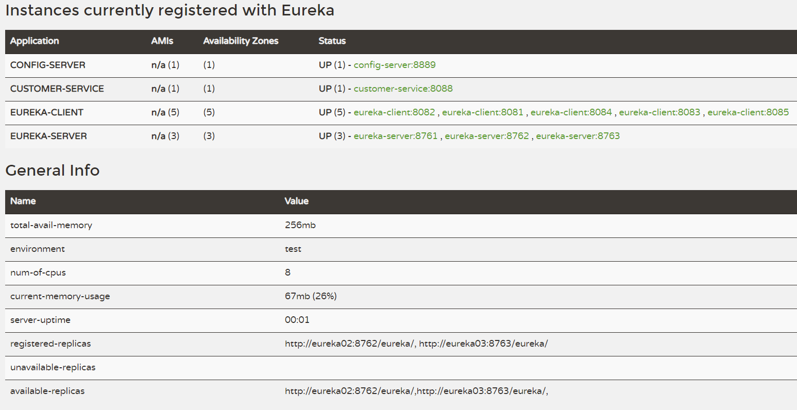

# SpringCloudMvnDemo

SpringCloud微服务开发Demo

使用`Spirng-Cloud-Netflix-Eureka-Server`作为服务注册中心，模拟多节点集群；

使用`Spirng-Cloud-Netflix-Eureka-Client`作为服务提供者在Eureka-Server注册，模拟多节点集群；

使用`Spring-Cloud-Config-Server`作为配置服务，通过git读取配置信息；

使用`Spring-Cloud-Config-Client`来读取Config-Server的配置信息，可以在运行时动态更新。


## 目录结构

`.idea`  存放intellij idea的相关配置信息，保存了Run Configuration，可以在idea中一键启动各个节点。

`config-server`  配置服务，从Github仓库中读取需要的配置信息。配置信息仓库地址。默认占用端口：8889。

`customer-service`  业务服务，也作为一个服务注册到Eureka-Server中，也可以从Eureka-Server中发现服务，也作为Config-Client从Config-Server读取配置信息。默认占用端口：8088。访问地址`http://localhost:8088/show`

`eureka-client`  作为服务提供方注册在Eureka-Server中，yml中配置了五个节点。默认占用端口：8081，8082，8083，8084，8085。

`eureka-server`  作为服务注册中心，接收其他服务的注册信息，周期性地检查注册的服务的健康状态，保持可用性。默认占用端口：8761，8762，8763。访问地址`http://eureka01:8761`


## 环境准备

1. `Java`  --- 11.0.7

2. `Maven` --- 3.6.3

3. 为启动多节点，需要对电脑的hosts文件进行修改，请将下面两行加入到hosts文件中的最后。

   ```
   127.0.0.1       eureka01 eureka02 eureka03
   127.0.0.1       eureka-client-01 eureka-client-02 eureka-client-03 eureka-client-04 eureka-client-05
   ```


## 启动方式

### 使用idea一键启动

`alt+8`快捷键可以调出idea的Services窗口， 选中全部即可一键启动。

建议分批次启动：先启动`Eureka-Server`的节点，再启动`Eureka-Client`的节点，接着启动`Config-Server`的节点，最后再启动`Customer-Service`的节点


### 手动在命令行启动或在idea中设置命令行参数

在单机环境中模拟多节点，需要通过使用不同的命令行参数来启动一个项目。

首个节点不需要下面的参数，从第二个开始就需要输入参数，参数最后的数字需要递推。

```
Eureka-Server：--spring.profiles.active=server-02

Eureka-Client：--spring.profiles.active=client-02
```

参数设置可以在对应项目的application.yml中查看或修改。


## 额外说明

1. 所有项目均添加了Actuator，可以对`http://host:port/actuator/info`发送Get请求获取当前节点的信息。
2. `Config-Server`读取的配置信息的地址为：`https://github.com/TwinkleSevenStream/spring-cloud-config-demo`
3. `Customer-Service`支持运行时动态刷新读取`Config-Server`的配置信息，对`http://host:port/actuator/refresh`发送POST请求，即可触发刷新。


## 运行效果截图

idea中的services窗口：


访问Eureka-Server节点1的地址`eureka01:8761`：

图1：



DS Replicas显示了其他可用的Eureka-Server节点

Instances currently registered with Eureka中显示了各个注册的服务及其可用的节点


图2：



